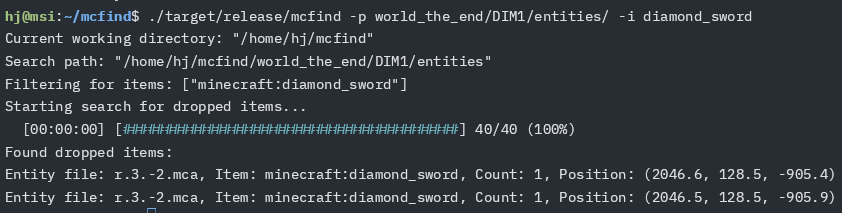

# MCFind

MCFind is a command-line tool for finding dropped items in Minecraft worlds.

If you're dead and don't know your coordinates, use this program to find them.
It has been tested on the latest Minecraft version (1.21.3), but should work well with other recent versions.

## Features

- Search for dropped items in Minecraft entities files (.mca)
- Filter by specific item types
- Display exact coordinates of items
- Fast searching with multithreading(rayon)

## Installation

```bash
git clone https://github.com/lidarbtc/mcfind.git
cd mcfind
cargo build --release
```

## Usage

Basic usage:
```bash
mcfind --path <world_entities_folder_path>
```

Search for specific items:
```bash
mcfind --path <world_entities_folder_path> --items diamond_sword,shulker_shell
```

### Arguments

- `--path`, `-p`: Path to Minecraft world entities folder (required)
  - Overworld: `<world_folder>/world/entities/`
  - End: `<world_folder>/world_the_end/DIM1/entities/`
  - Nether: `<world_folder>/world_nether/DIM-1/entities/`
- `--items`, `-i`: List of specific items to search for (optional)
  - Comma-separated list of item IDs
  - `minecraft:` prefix is optional

## Output Example


